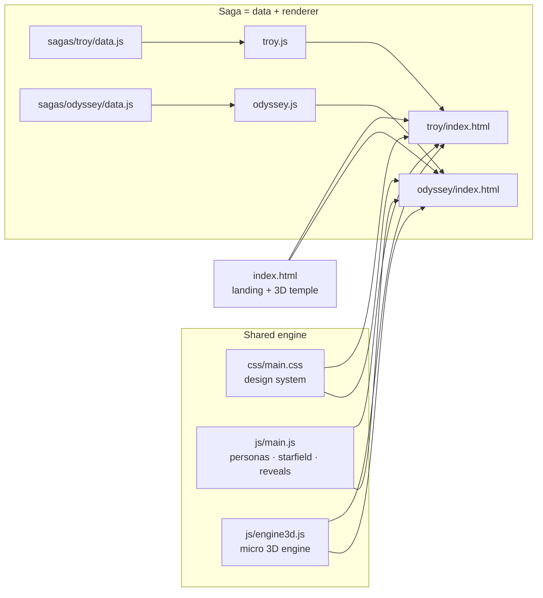

# 🏛️ HistoryScapes

**See history. Remember it forever.**

An open-source home for *visual* history — interactive 3D scenes, journey maps and story
diagrams that turn the great events of the past into something you can explore, not just read.
Every fact adapts to who's looking: a school kid, a movie buff fresh out of the cinema, or a
history geek who wants the archaeology.

**Live site:** https://mohitagw15856.github.io/historyscapes/

> Nolan's *The Odyssey* just sent millions of people googling "was Troy real?"
> This project is the answer we wish they'd land on.

---

## ⚡ What's inside

| Saga | What you get | Status |
|------|--------------|--------|
| **01 · The Fall of Troy** | Ten years of war in 8 chapters, a drag-to-rotate 3D Trojan Horse, an interactive character web of gods & heroes, and a Myth-vs-Dig section on the real excavations at Hisarlik | ✅ Live |
| **02 · The Odyssey** | All 14 stops of the ten-year voyage on an interactive chart of the mythic Mediterranean, with a 3D ship sailing animated waves | ✅ Live |
| **03 · Your era here** | Rome? Egypt? The Silk Road? The Mahabharata? See [CONTRIBUTING.md](CONTRIBUTING.md) | 🙌 Open |

### One story, three voices

Every fact on the site is written three times and switches live:

- 🧭 **Young Explorer** — fun, simple, memorable ("the cooked meat MOOED on the grill")
- 🎬 **Movie Buff** — connects the myth to cinema and pop culture
- 🏛️ **Historian** — the sources, the digs, the evidence

### Zero dependencies, on purpose

No frameworks, no build step, no npm. The 3D scenes run on a **~300-line hand-rolled
engine** (`js/engine3d.js`): perspective projection, flat shading, painter's algorithm,
drag-to-orbit — plain `<canvas>` 2D. Clone it, open `index.html`, it works.

## 🗺️ How it fits together



The key idea: **story content lives in `data.js` files, rendering lives in page scripts.**
You can improve the storytelling, fix a fact, or add a whole new saga without touching a
line of engine code.

## 🚀 Run it locally

```bash
git clone https://github.com/mohitagw15856/historyscapes.git
cd historyscapes
python3 -m http.server 8000   # or just open index.html
```

## 🤝 Contributing

The easiest PRs, in ascending order of ambition:

1. **Fix a fact** — edit a `sagas/*/data.js` file (cite a source in the PR)
2. **Improve a persona voice** — make an explorer fact funnier, a historian fact sharper
3. **Add a scene** — a new diagram, 3D mesh or animation for an existing saga
4. **Add a saga** — a new folder under `sagas/` with a `data.js` + renderer

Full guide: [CONTRIBUTING.md](CONTRIBUTING.md)

## 📜 License

[MIT](LICENSE) — free for classrooms, remixes, and everything else.

Sister project: [ScienceScapes](https://github.com/mohitagw15856/sciencescapes) — the same
philosophy, pointed at science.
